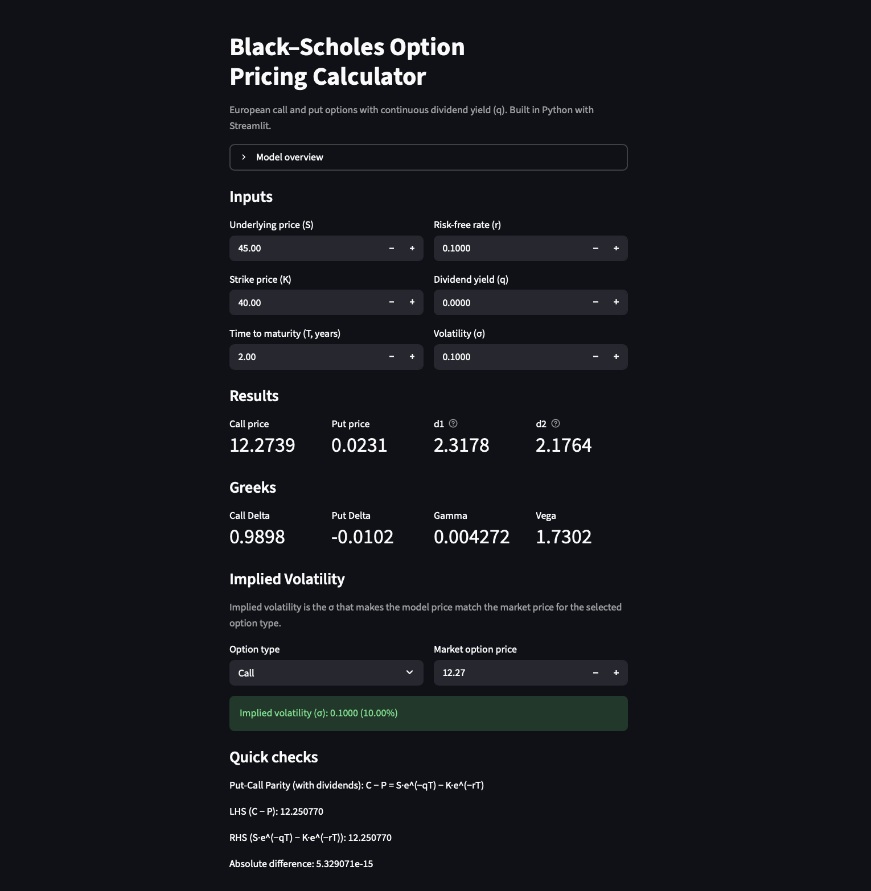

## 🔴 Live app
👉 https://roman-black-scholes-pricer.streamlit.app/



# Black–Scholes Option Pricing Calculator

A Python + Streamlit web app that prices European call and put options using the Black–Scholes model. Includes Greeks, implied volatility (bisection solver), and a put–call parity check.

## Features
- European call and put pricing (no dividends)
- Greeks: Call Delta, Put Delta, Gamma, Vega
- Implied volatility solver (bisection)
- Put–call parity quick check
- Interactive Streamlit UI

## Tech Stack
- Python
- Streamlit
- SciPy (normal CDF/PDF)

## How to Run Locally
1. Clone the repo
```bash
git clone https://github.com/Aaron-cody/black-scholes-option-pricing.git
cd black-scholes-option-pricing
