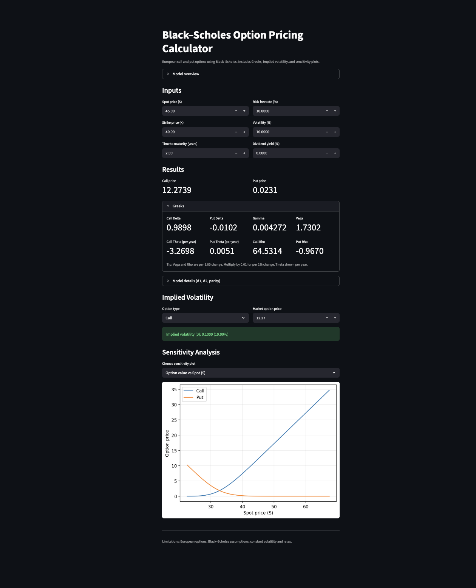

# Black-Scholes Option Pricing Calculator

<<<<<<< HEAD
## 🔴 Live app
👉 https://roman-black-scholes-pricer.streamlit.app/


=======
An interactive Black-Scholes option pricing application built to demonstrate option pricing theory, risk sensitivities, and practical quantitative trading intuition.  
The app progresses from core pricing mechanics to sensitivity analysis and implied volatility extraction, reflecting how option models are used in practice.
>>>>>>> 1fd342e9a2c351d4745d68c36bafe1fe4154e34f

🔴 **Live app:** https://roman-black-scholes-pricer.streamlit.app

---

## Overview

This project implements the Black-Scholes model for European options and extends it with risk analytics and scenario exploration.  
The goal is not only to compute prices, but to understand how option values respond to changes in key inputs such as spot price, volatility, and time to maturity.

The application is deployed as an interactive Streamlit dashboard and designed to resemble a lightweight trading or research tool rather than a standalone script.

---

## Features

### 1. Option Pricing Engine
- European call and put pricing using the Black-Scholes model
- Support for dividend yield
- Put-call parity consistency

### 2. Greeks and Risk Sensitivities
- Delta (call and put)
- Gamma
- Vega
- Theta (annualized)
- Rho (call and put)

Greeks are displayed alongside prices to emphasize risk interpretation, not just valuation.

### 3. Implied Volatility
- Computes implied volatility from a market option price
- Supports both call and put options
- Demonstrates inversion of the Black-Scholes formula as used in real markets

### 4. Sensitivity Analysis
- Visualizes option value as a function of:
  - Spot price
  - Volatility
- Enables intuitive understanding of convexity and volatility exposure

### 5. Interactive Dashboard
- Built with Streamlit
- Real-time parameter updates
- Clean, trader-style layout focused on usability

---

## Tech Stack

- Python
- Streamlit
- NumPy
- SciPy
- Matplotlib

---

## How to Run Locally

```bash
git clone https://github.com/Aaron-cody/black-scholes-option-pricing.git
cd black-scholes-option-pricing
pip install -r requirements.txt
streamlit run streamlit_app.py
